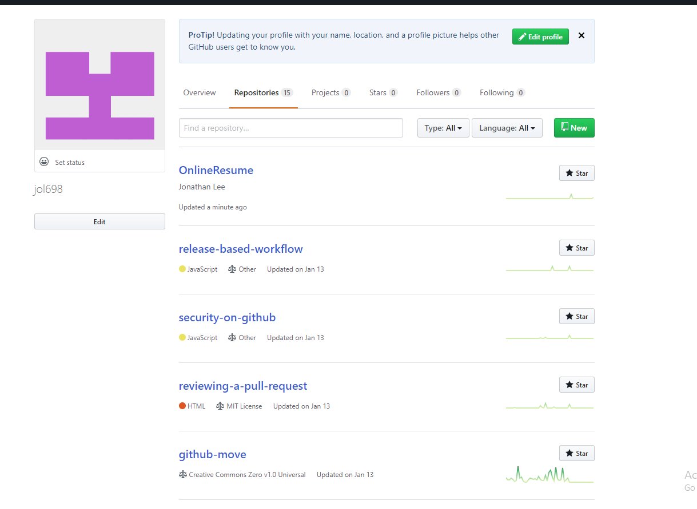

<h1> Technical Skills and Certifications </h1>

<h2> Technical Skills </h2>

Github

  I completed the following courses in the <a href="https://lab.github.com/courses">GitHub Learning Lab</a>.
  <h4>Courses:</h4>
<ul>
<li>Introduction to GitHub</li>
<li>Communicating using Markdown</li>
<li>Introduction to HTML</li>
<li>GitHub Pages</li>
<li>Managing merge conflicts</li>
<li>Community Starter Kit</li>
<li>Uploading your project to GitHub</li>
<li>Getting started with GitHub Apps</li>
<li>Migrating your repository to GitHub</li>
<li>Reviewing pull requests</li>
<li>Securing your workflows</li>
<li>Create a release based workflow</li>
</ul>
   

 
  

Linux

  

PowerBi

  

AWS

  

