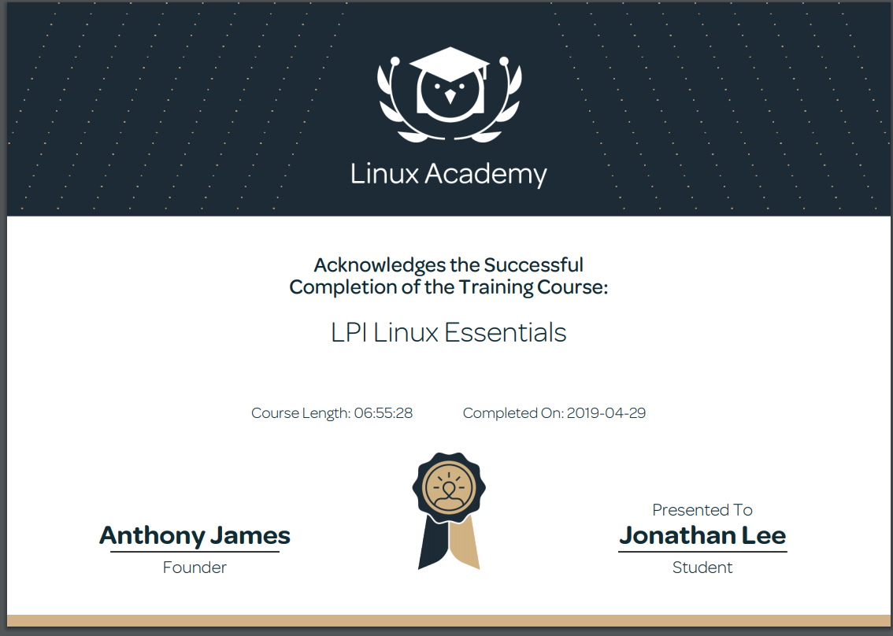
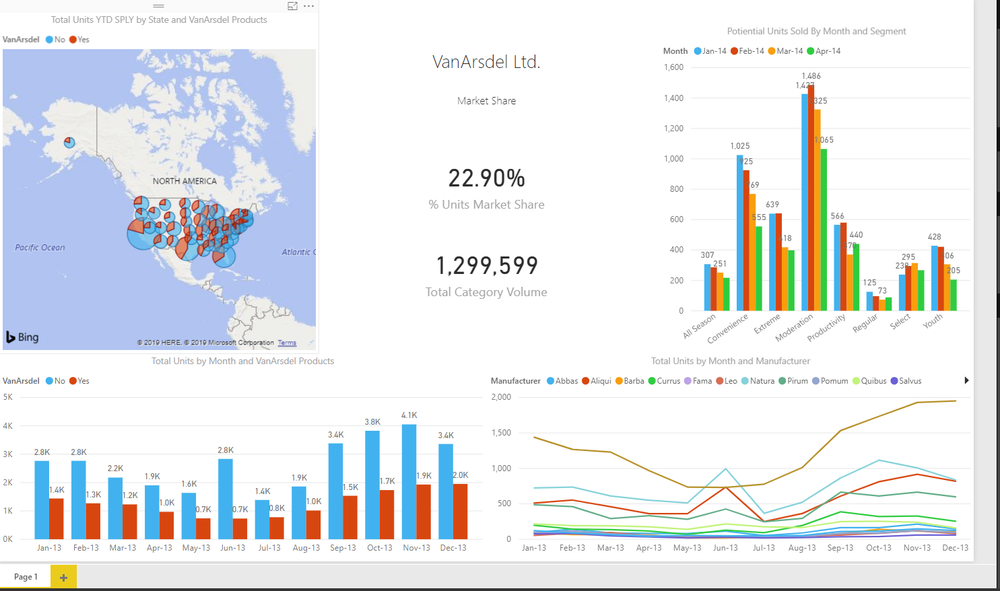
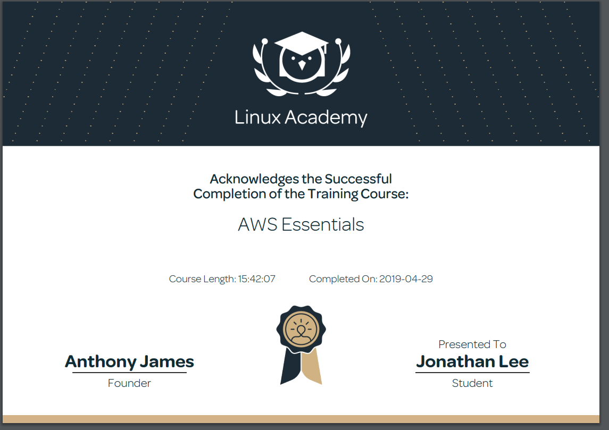

<h1> Technical Skills and Certifications </h1>

<h2> Technical Skills </h2>

Github

  I completed the following courses in the <a href="https://lab.github.com/courses">GitHub Learning Lab</a>.
  <h4>Courses:</h4>
<ul>
<li>Introduction to GitHub</li>
<li>Communicating using Markdown</li>
<li>Introduction to HTML</li>
<li>GitHub Pages</li>
<li>Managing merge conflicts</li>
<li>Community Starter Kit</li>
<li>Uploading your project to GitHub</li>
<li>Getting started with GitHub Apps</li>
<li>Migrating your repository to GitHub</li>
<li>Reviewing pull requests</li>
<li>Securing your workflows</li>
<li>Create a release based workflow</li>
</ul>
   

 
  

Linux

  I completed the LPI Linux Essentials course on <a href="https://linuxacademy.com/">Linux Academy</a>.
  <h4>Topics:</h4>
<ul>
<li>The Linux Community and a Career in Open Source</li>
<li>Linux Evolution and Popular Operating Systems</li>
<li>How to Access a Linux Installation</li>
<li>Major Open Source Applications</li>  
<li>Understanding Open Source Software and Licensing</li> 
<li>ICT Skills and Working in Linux</li>
<li>Command Line Basics</li> 
<li>Using Directories and Listing Files</li> 
<li>Archiving Files on the Command Line</li> 
<li>Searching and Extracting Data from Files</li> 
<li>Turning Commands into a Script</li>
<li>The Linux Operating System</li>
<li>Security and File Permissions</li>
<li>Basic Security and Identifying User Groups</li>
<li>Creating Users and Groups</li> 
<li>Managing File Permissions and Ownership</li> 
<li>Special Directories and Files</li> 
</ul>
  LPI Linux Essentials Course Completion Certificate:

  

PowerBI

  <ul>
    I auditted the <a href="https://www.edx.org/course/analyzing-and-visualizing-data-with-power-bi-0">Analyzing and Visualizing Data with Power BI</a> course on edX and completed the following courses.
<li>Power BI Desktop Data Transformations</li>
<li>Power BI Desktop Modelling</li>
<li>Power BI Desktop Visualization</li>
<li>Power BI Service</li>
<li>Working with Excel</li>
<li>Direct Connectivity</li>
<li>Developer API</li>
<li>Mobile App</li>
  
      
  
<li>This is a link showing me explaining a PowerBI dashboard I made https://youtu.be/OKkpN1zA2yI </li>

</ul>
  

AWS

  I completed the AWS Essentials course on <a href="https://linuxacademy.com/">Linux Academy</a>.
  <ul>
  <li>AWS Essentials</li>
  <li>Managing AWS Access with Users, Groups, and Roles</li>
  <li>Identity and Access Management (IAM)</li>
  <li>Networking Services and Connectivity</li>
  <li>Virtual Private Cloud (VPC)</li>
  <li>Compute Services</li>
  <li>Elastic Cloud Compute (EC2)</li>
  <li>Storage Services</li>
  <li>Database Services</li>
  <li>Monitoring, Alerts, and Notifications</li>
  <li>Simple Notification Service (SNS)</li>
  <li>Load Balancing, Elasticity, and Scalability</li>
  <li>Elastic Load Balancer (ELB)</li>
  <li>Auto Scaling</li>
  <li>Route 53</li>
  <li>Serverless Computing - Lambda</li>
    
</ul>
  

